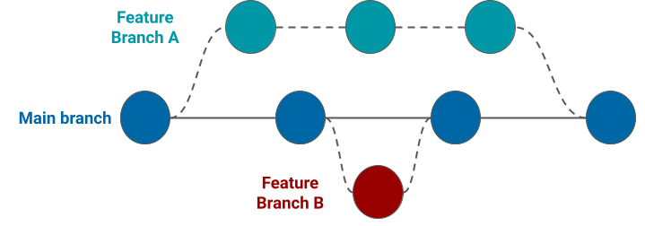

# CSU Git Tutorial

This repository serves as a simple, safe place to experiment with Git/GitHub commands. The original intended audience was CSU physics graduate students who need to learn version control for their analysis work, but the principles here can apply to anyone trying to learn Git. This tutorial will focus on using Git via a command-line interface, specifically Linux/Mac command line. This interface is commonly used on high-performance computing clusters that don't have a graphical interface. Many modern particle physics experiments run their production code on such compute clusters, so knowing how to work with a command-line interface is essential.  

# Git? Github? Why should I care?

Simply put, Git is free, open-source version control software. Utilized correctly, it allows many people to work from the same code base without stepping on each others' toes or breaking the production code for everyone. Git can create "snapshots" or your repository at a given time, and those snapshots can be retrieved later. It also allows for individuals to branch off the "main" code branch to implement their own changes. Modifications made in these _feature branches_ wont' affect the main branch until the repository maintainer(s) decided to merge the changes into main. A simple visualization of this is shown below.



Any repository that uses Git can be stored on GitHub, a cloud-based hosting service for managing git repositories. Many of the commands we'll learn here can be performed in GitHub rather than on the command line, but this isn't always an option when working in a command-line environment such as those found on most high-performance compute clusters. 

As for why you should care, there are several reasons:
- __Branch workflow__: Git allows individuals to modify and experiment with code in a way that doesn't interfere with others. This allows for improvements to be introduced in a staged, parallel manner, ensuring overall stability of the main code base.
- __Reproducibility__: Having snapshots of your code means you can always revert back to an older snapshot if something breaks. Even when nothing is broken, having a common code base for everyone to work from ensures stability and reproducibility.
- __Widely used__: Both in and outside of academia, Git and GitHub are everywhere. Some physics experiments host their experiment-wide production code on GitHub. No matter your future prospects, GitHub will prove an invaluable tool for your career. 

# Getting Started

First, you'll need to install Git. See the instructions [here](https://git-scm.com/book/en/v2/Getting-Started-Installing-Git) for installation instructions on Mac, Linux, and Windows. To check your installation, run
```
git --version
```
from the command line. Your output should say something like
```
git version 2.34.1
```

The next step is to "clone" this repository from the remote (GitHub) to local (your machine). Click the green "Code" button in the upper-right of this page and copy the URL there. Then, from the command line, run
```
git clone <copied_url>
```
where you should replace `<copied_url>` with whatever was in the "Code" box. Wherever you are on your machine, Git will create a new directory with the name of this repository&mdash;`csu_git_tutorial`, in this case. You can then enter that directory by typing
```
cd csu_git_tutorial
```

# Basic Git Commands

So, you've cloned a repository to your local machine. Now what? A good first step is to run `git status`, an essential Git command that summarizes the current state of your code. Assuming you haven't made any changes, the output will look something like this:
```
On branch main
Your branch is up to date with 'origin/main'.

nothing to commit, working tree clean
```

Since we haven't made any changes to the code yet, there isn't much to see. Importantly, the first line tells you which branch you're on. When you first clone a repsoitory, you'll usually be in the `main` branch by default. __Before you start making changes__, it's good practice to create a new branch and make your changes there. First, let's look at what branches are already available using `git branch --list`:
```
* main
```
Naturally, there's only one branch, `main`. The `*` indicates which branch you're currently on. Now, let's create a new branch where we can start making changes. To create a new branch on Git, simply run
```
git switch -c my_new_branch
```
where `my_new_branch` can be any name you want. You should see something like `Switched to a new branch 'my_new_branch'` output to the command line. As the name implies, `git switch` is used for switching between branches. Passing the `-c` flag creates a new branch and then switches to it. (__Note__: `git switch` has replaced the older `git checkout` command. If you see older documentation refer to `git checkout`, just know that the two are functionally the same, but `git switch` has more intuitive syntax and is now the preferred method.) Now, if we run `git status` again:
```
On branch my_new_branch
nothing to commit, working tree clean
```
and `git branch`:
```
  main
* my_new_branch
```

We see that we've successfully created and switched to `my_new_branch`. 

## Modifying the Code

Next, let's see what happens when we modify a file. Open up `text_file.txt` in your favorite text editor and you'll see that it contains a single line of text:

```
Here's some text. When you pull this repository, this is how the file will appear by default.
```

Let's add a second line with some arbitrary text:

```
Here's some text. When you pull this repository, this is how the file will appear by default.
Here's a new line.
```

Now, if we run `git status` we'll see that Git has detected a change to this file:

```
On branch my_new_branch
Changes not staged for commit:
  (use "git add <file>..." to update what will be committed)
  (use "git restore <file>..." to discard changes in working directory)
        modified:   text_file.txt

no changes added to commit (use "git add" and/or "git commit -a")
```

There's now a new section labeled "Changes not staged for commit." As you may have realized, this is where you'll see a list of files that have been modified since the last time someone "committed" changes to the code, i.e., since the last code snapshot. You'll also notice that Git suggests two commands: `git add` to add your updated file to the "staging" area (things that will be updated in the next code snapshot) and `git restore` to restore the file to the state it was in during the previous snapshot. Before adding or restoring files, though, I suggest using `git diff` to examine the changes to your file. If you run `git diff text_file.txt` you'll see something like

```
diff --git a/text_file.txt b/text_file.txt
index 48125aa..b3f3b2a 100644
--- a/text_file.txt
+++ b/text_file.txt
@@ -1 +1,2 @@
 Here's some text. When you pull this repository, this is how the file will appear by default.
+Here's a new line.
```

The first line tells you which files are being compared. In this case, we're looking at two versions of `text_file.txt` labeled `a` and `b`. The next line shows the file indices as seen by Git. These have a specific meaning in Git, but we don't need to go into that much detail here. The next two lines tell you that version `a` of the file (the previous code state version) will be represented by minus signs, while version `b` (the current version) will be represented by plus signs. The numbers sandwiched between `@@` tell you how many lines are being shown for each file. The `-1` tells us that, for file `a` (remember this one is represented with minus signs), one line is shown. The `+1,2` bit tells you that, for file `b`, one line is shown starting from line 2. Since we only modified the second line of `text_file.txt`, this makes sense. Finally, the bottom lines show you the actual differences between the two files. In this case, the only difference is that the `b` version has one additional line, represented here with the plus sign. If there were lines of code that were only in the `a` version, those would be displayed with a minus sign next to them. 

Don't underestimate `git diff`&mdash;it's an invaluable tool that shows you exactly what has changed beteween code snapshots. In addition to individual files, it can also show differences between branches or other code snapshots. I recommend always looking at the output of `git diff` before staging any changes. Speaking of which, let's finally use `git add` to stage this one change for a commit:

```
git add text_file.txt
```

The `git status` output will now look like

```
On branch my_new_branch
Changes to be committed:
  (use "git restore --staged <file>..." to unstage)
        modified:   text_file.txt
```

which tells us that our modified file is currently staged for a commit. We can also use `git restore --staged` to "unstage" the file. Let's go ahead and "commit" this change, meaning it will be added to the next code snapshot. When committing code changes, it's recommended to write a _commit message_ that explains what you changed and why. You can write a message while you commit using the `-m` flag like so:

```
git commit -m "Add line of text"
```

Writing good commit messages is crucial when working with many people on the same code base. We could go down a rabbit hole of how to write good commit messages here, but for now I'll just provide [this link](https://www.theserverside.com/video/Follow-these-git-commit-message-guidelines#:~:text=If%20you%20want%20to%20write,Instead%2C%20describe%20what%20was%20done.) for you to peruse at your leisure. 

After commiting your changes, you'll get some output like
```
 1 file changed, 1 insertion(+)
```

which is what we'd expect for only changing a single line. If you now run `git status` again, you'll see that we're back to a state of `nothing to commit, working tree clean`. To view a log of our commit and the ones before it, we can use `git log -n 1` (the `-n` flag specifies how many commits to show):

```
commit cf474596ec0b2464638bd7df0039661a1414e07c (HEAD -> my_new_branch)
Author: Andrew Mogan <andrew.mogan@colostate.edu>
Date:   Thu Jun 22 11:41:03 2023 -0600

    Add line of text

```
Aside from the first line, this is largely self-explanatory&mdash;you'll see the person who made the commit (me, in this case), the date and timestamp of the commit, and the commit message. The first line shows the _commit hash_, a unique identifier for this code snapshot that we can use to revert back to this code state at any time. We can also use this hash as input to `git diff` if we want to compare some future commit to this one. This first line also introduces an important keyword in Git, `HEAD`. Basically, `HEAD` is your current branch's latest commit, so `HEAD -> my_new_branch` says that our commit was added to the branch `my_new_branch`. If you want to look at older commits, you can increase the number passed to `-n`. By default, Git will display as many commits as it can fit on the screen in reverse chronological order, so I recommend using `-n` to just show the last handful of commits. 

Finally, we're ready to "push" our changes to the remote repository. In general, this is done my simply running `git push` after commiting your changes, but, in our case, you'll probably see something like

```
fatal: The current branch my_new_branch has no upstream branch.
To push the current branch and set the remote as upstream, use

    git push --set-upstream origin my_new_branch
```

What this tells you is that `my_new_branch` only exists in your local repository but not the remote, so Git isn't sure where to push these changes. Luckily, Git tells us the exact command to fix this: `git push --set-upstream origin my_new_branch`. This will create a branch of the same name on the remote repository and push your changes there. After pushing this way, you'll see some technical output that isn't terribly important for our purposes followed by something like

```
To https://github.com/andrewmogan/csu_git_tutorial.git
 * [new branch]      my_new_branch -> my_new_branch
Branch 'my_new_branch' set up to track remote branch 'my_new_branch' from 'origin'.
```

which confirms that `my_new_branch` has now been added to the remote. 

## Pulling Changes from Remote

So far, we've looked at making our own changes to the code and pushing those changes to the remote repository. However, you won't be able to push your changes unless your local repository is up-to-date with the remote version. To get the latest changes from the remote, simply run `git pull`. If your code is up-to-date, you'll see `Already up to date.` printed to the terminal. Otherwise, Git will show a list of files that have changed and how many insertions or deletions there were for each file. `git pull` is actually a combination of two other Git commands: `git fetch` followed by `git merge`. `git fetch` checks the remote repository for changes, but doesn't do anything with those changes. `git merge` is used to merge changes from one branch or commit to another. Remember to pull frequently so that your code doesn't deviate too far from the remote. If deviations between branches become unresolvable, you'll encounter the dreaded "conflict." We won't go into resolving Git conflicts here, but you can use [this link](https://docs.github.com/en/pull-requests/collaborating-with-pull-requests/addressing-merge-conflicts/resolving-a-merge-conflict-using-the-command-line) when you're ready to learn.

## Summary of Common Git Commands

This list below summarizes the commands we learned in this simple tutorial. Note that some of these commands require additional command-line arguments that are not shown here. If you forget some command-line arguments, Git will usually tell you what's missing. 

- `git clone`: copy remote repository to your local machine.
- `git status`: view current edits, branch, etc.
- `git branch`: view available “branches” (other people's’ code state).
- `git fetch`: get the latest changes from remote _without merging_.
- `git merge`: Merge changes from another branch into your current branch.
- `git pull`: get latest changes from remote and merge them into local. This is actually an alias for `git fetch` followed by `git merge`.
- `git switch`: switch between branches. Pass the `-c` flag to create a new branch and switch to it. 
- `git add`: choose files to be “staged” (added to code snapshot).
- `git commit`: create a snapshot of your current code state. Pass the `-m` flag to create a commit message.
- `git push`: “push” your changes from local to remote.
- `git diff`: view difference in your code state relative to some previous commit (most recent commit by default).
- `git log`: display a log of commits. Pass the `-n` flag to limit how many log entries are printed.

# Conclusion
Congratulations, you now know the basics of version control using Git! There are many more advanced topics that aren't covered here, such as Git issues, pull requests, forks, and much, much more. Git can seem intimidating to work with, but as long as you're careful and follow best practices, you won't need to worry about breaking important code and causing your coworkers a huge headache. I'll leave you with a few guidelines based on my personal experience that can help you avoid future headaches:

- __Commit early and often__: The more commits you have, the more stable code states you can revert back to in case of emergency. Frequent commit messages also help document incremental code changes.
- __Write good commit messages__: I didn't go into much detail here on commit messages, but please avoid writing things like "bug fix." What bug? How was it fixed? This message isn't helpful for anyone. Instead, write a concise description of what you changed, or create a [longer commit message](https://haydar-ai.medium.com/learning-how-to-git-creating-a-longer-commit-message-16ca32746c3a) if necessary.
- __Make experimental changes in a feature branch__: In general, you don't want to work from the `main` branch since your changes may introduce bugs or other unintended behavior.
- __Things will go wrong; don't panic__: Inevitably, something will break, or Git will spit out some message that you don't understand. Luckily, we live in an era of Google and ChatGPT. Whatever issue you run into with Git, someone else has been in the same boat, so learn from them.

# Additional Resources

Below are some useful links for furhter information on using Git.

- [Software Carpentry Workshop on using Git](https://swcarpentry.github.io/git-novice/). This tutorial starts off simple, but goes into more detail than I did here. Once you're comfortable with the material in my tutorial, this one could be a good next step.
- [FreeCodeCamp guide to good commit messages](https://www.freecodecamp.org/news/how-to-write-better-git-commit-messages/)
- [Resovling merge conflicts](https://docs.github.com/en/pull-requests/collaborating-with-pull-requests/addressing-merge-conflicts/resolving-a-merge-conflict-using-the-command-line). This is an important topic that we didn't cover here.


